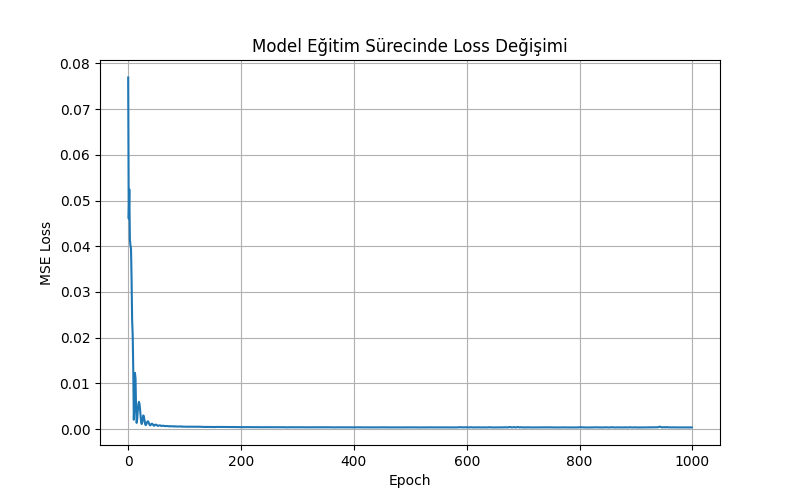
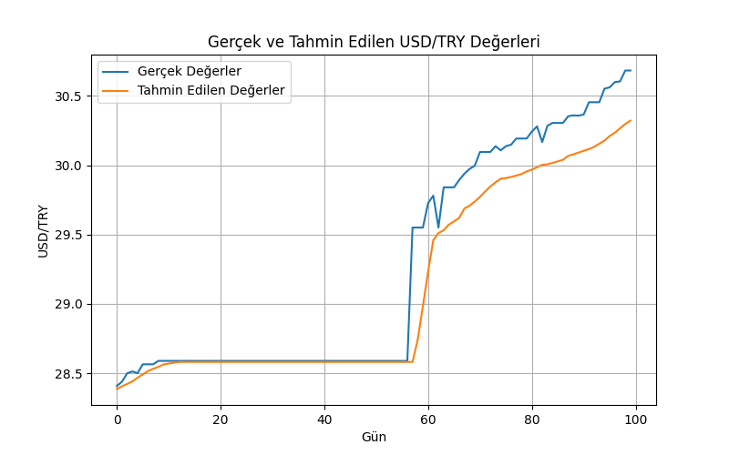

# USD/TRY Döviz Kuru Tahmini (LSTM)

LSTM-based deep learning model for USD/TRY exchange rate time series forecasting.

Bu proje, USD/TRY döviz kurunun geçmiş değerlerinden yararlanarak bir sonraki günün döviz kuru değerini tahmin etmeyi amaçlamaktadır. Çalışma kapsamında, finansal zaman serilerinin modellenmesinde yaygın olarak kullanılan Uzun Kısa Süreli Bellek (Long Short-Term Memory – LSTM) tabanlı bir derin öğrenme modeli geliştirilmiştir.

Proje, **BİL485 Derin Öğrenme** dersi kapsamında akademik amaçla hazırlanmıştır.

---

## Proje Kapsamı

- 2010–2024 yılları arasındaki **günlük USD/TRY döviz kuru verileri** kullanılmıştır.
- Finansal zaman serisi tahmini problemi ele alınmıştır.
- Model, **son 4 güne ait USD/TRY değerlerini** girdi olarak almakta ve **bir sonraki günün kurunu** tahmin etmektedir.
- Model eğitimi **PyTorch** kütüphanesi ile gerçekleştirilmiştir.
- Eğitim süreci ve tahmin performansı **grafikler ile görselleştirilmiştir**.
- Eğitilen model, **Gradio tabanlı bir kullanıcı arayüzü** ile servis edilmiştir.

---

## Klasör ve Dosya Yapısı

├── USD_to_TL_currency_2010_2024_years.csv # Kullanılan veri seti
├── model.py # LSTM model mimarisi
├── train.py # Model eğitimi ve değerlendirmesi
├── serve.py # Eğitilen modelin servis edilmesi
├── usdtry_lstm.pth # Eğitilmiş model ağırlıkları
├── loss_graph.png # Eğitim sürecinde loss grafiği
├── real_vs_pred.png # Gerçek ve tahmin edilen değerler
└── README.md # Proje açıklaması


---


## Kullanılan Teknolojiler

- Python  
- PyTorch  
- Pandas  
- NumPy  
- Matplotlib  
- Gradio  

---

## Model Eğitimi

Modeli eğitmek için aşağıdaki komut çalıştırılmalıdır:

```bash
python train.py
```

Bu işlem sonucunda:
- LSTM modeli eğitilir
- Eğitim sürecine ait loss grafiği oluşturulur (`loss_graph.png`)
- Gerçek ve tahmin edilen USD/TRY değerleri karşılaştırılır (`real_vs_pred.png`)
- Eğitilen model `usdtry_lstm.pth` dosyası olarak kaydedilir


---

## Model Servisi

Eğitilen LSTM modeli, eğitim sonrası kullanım senaryosunu göstermek amacıyla Gradio kütüphanesi kullanılarak servis edilmiştir. Bu servis sayesinde kullanıcı, modelle etkileşimli bir şekilde çalışabilmekte ve tahmin sonuçlarını gerçek zamanlı olarak gözlemleyebilmektedir.
Modeli kullanıcı arayüzü üzerinden test etmek için aşağıdaki komut çalıştırılmalıdır:

```bash
python serve.py
```

Bu komut çalıştırıldığında Gradio tabanlı bir web arayüzü açılır. Kullanıcı, son 4 güne ait USD/TRY döviz kuru değerlerini girerek bir sonraki günün tahmin edilen değerini görüntüleyebilir.

## Eğitim Süreci Görselleri

### Loss Değişimi


### Gerçek vs Tahmin Edilen Değerler


